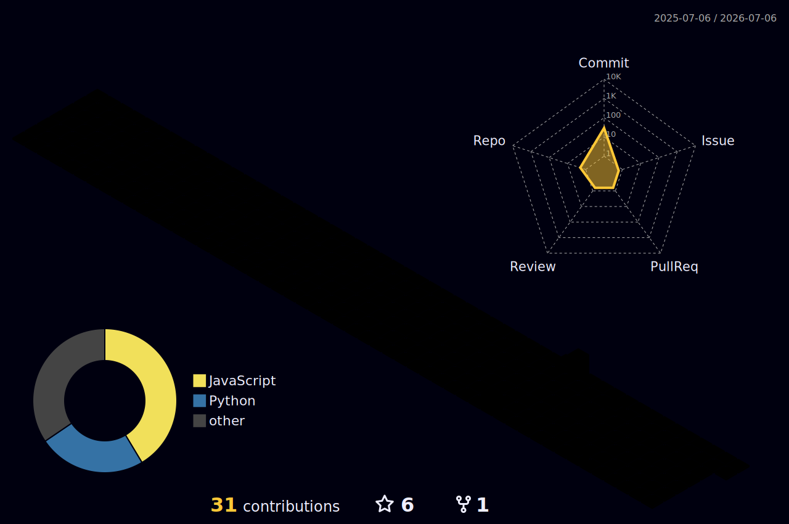

# Hey there, I'm Lison 👋

---

## 🙋‍♂️ About Me

- 🌱 Currently learning **Android & Python**
- 💻 Check out my projects at **[lison.netlify.app](https://lison.netlify.app/)**
- 📬 Reach me at **lisonsabu@gmail.com**
- ⚡ *Not a Pro — just a very enthusiastic person*

---

## 🌐 Connect with Me

---

## 💻 Tech Stack

**Languages**

**Frontend**

**Backend & DB**

**Deployment**

---

## 📊 GitHub Stats

 

---

## 😂 Random Dev Joke

---

## 📦 3D Contribution Graph

<picture>
  <source media="(prefers-color-scheme: dark)" srcset="./profile-3d-contrib/profile-night-rainbow.svg" />
  <source media="(prefers-color-scheme: light)" srcset="./profile-3d-contrib/profile-green.svg" />
  
</picture>

---

*Thanks for stopping by! Feel free to explore my repos* 🚀

